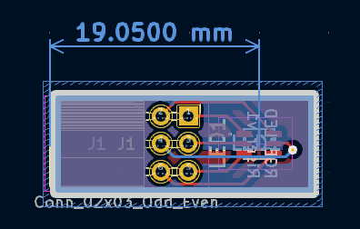
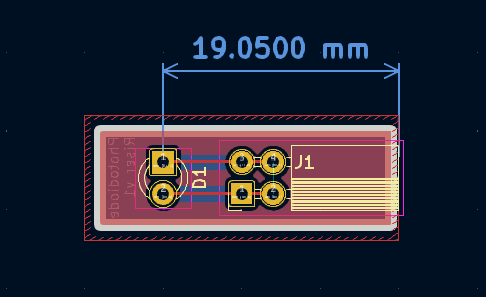

# Two channel colorimeter

Folders:
- `board-main/` - KiCad project of main PCB
- `board-led/` - KiCad project of RGB LED riser board
- `board-photodiode/` - KiCad project of photodiode riser board
- `symbols/` - common KiCad symbol libraries
- `footprints/` - common KiCad footprint libraries + 3D models

## Main PCB

## Riser boards

Both riser boards position the optical center of their respective devices at 19.05mm above the "bottom" edge of the pin socket connector:

## TODO

- [ ] Choose one of the many available methods for driving the LEDs
- [ ] Prepare 3D model for 3D printed holder
- [ ] Test manufacturing run!

